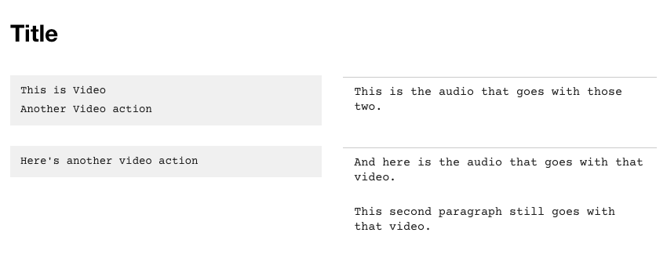

# AV Script Format Markdown CSS v03

by Mark Boszko

- boszko+github@gmail.com
- @bobtiki on social sites

## Contents

- `AVScriptMarkdown.css` - The stylesheet
- `AVScriptFormatTemplate.markdown` - A sample script document
- `README.markdown` - This file
- `AVScriptFormat.bbpackage` - The CSS and template in a package for BBEdit.

## Background

A/V Script Format is a very basic idea at its core. It's a table view -- two columns, side-by-side, with rows representing Video and Audio that are locked together. It's used a lot in documentary TV production (my background), and is well suited to making ads and promo videos for apps. This way you can make sure that the action you are doing and the voice explaining this action are linked to each other.

## Installation

This should work with any app that previews Markdown with a CSS stylesheet.

For best display, I recommend installing the free [Courier Prime font](http://www.quoteunquoteapps.com/courierprime/).

First, download the files by clicking the green **Clone or Download** button above. **Download ZIP** is the easiest option, unless you are familiar with using Git.

Then, here are installation instructions for a few specific apps. If your app isn't listed, you probably want to select the CSS file in your app's preview settings.

### BBEdit

You should be able to double-click the `AVScriptFormatV3.bbpackage` file, and it will install itself. Otherwise, put the CSS file in this folder:

`~/Library/Application Support/BBEdit/Preview CSS`

### Marked

In **Marked > Preferences > Style**, click the **+** button and select the CSS file to import it.

[More detailed directions on their site](http://marked2app.com/help/Custom_Styles.html).

### Ulysses

Drag the CSS file into the style preferences table or use the **Add Styles…** button.

[More directions on their site](http://www.ulyssesapp.com/styles/).

## Use

The CSS is designed so that an unordered list is shown as video notes on the left, and paragraph items are shown as audio items, on the right. In markdown, this is as simple as:

    # Title

    - This is Video
    - Another Video action
    
    This is the audio that goes with those two.
    
    - Here's another video action
    
    And here is the audio that goes with that video.
    
    This second paragraph still goes with that video.
    
The above markdown will result in this:

## Support

If you need help, hit me up on twitter or email (see above), and I'll see what I can do.
